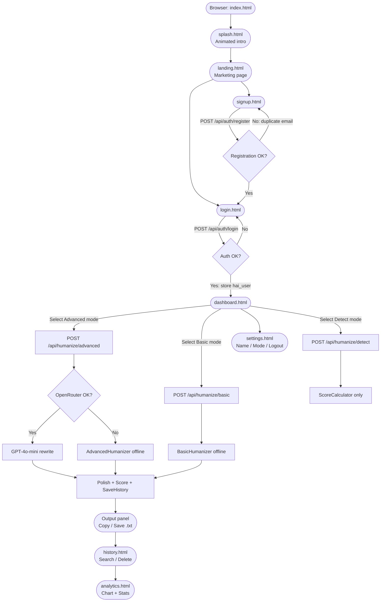
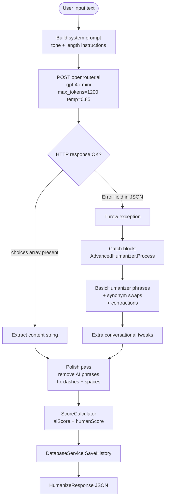

# Design — HumanizeAI

## High-Level Architecture

```
Browser
  └─> http://localhost:5000
        ├─> Static files (HTML/CSS/JS) from wwwroot/      ← served by ASP.NET Core
        └─> /api/*  REST endpoints                         ← ASP.NET Core controllers
                         └─> MySQL (humanizeai_db)         ← MySqlConnector 2.3.7
                         └─> OpenRouter API (Advanced mode only)
                               └─> openai/gpt-4o-mini
```

The backend is a single .NET 10 process. It serves the frontend as static files **and** runs the API. There is no separate frontend server, no npm build step, and no reverse proxy.

---

## Frontend Structure

| File | Purpose |
|---|---|
| `index.html` | Entry point — meta-refresh + JS redirect to `splash.html` |
| `splash.html` | Animated curtain-open logo screen; auto-redirects to `landing.html` |
| `landing.html` | Public marketing page with feature list and CTA |
| `login.html` | Email + password login form |
| `signup.html` | Name + email + password + confirm form |
| `dashboard.html` | Main app page: input/output panels, mode/tone/length controls, today's stats |
| `history.html` | Paginated list of past runs with search, copy, delete |
| `analytics.html` | Summary stats, 7-day Canvas chart, mode breakdown, detail table |
| `settings.html` | Display name, default mode preference, logout |
| `styles.css` | All global styles (no framework) |
| `app.js` | All frontend JavaScript — single file, page detected via `location.pathname` |

### app.js Page Routing

```js
DOMContentLoaded → read location.pathname →
  login.html     → initLogin()
  signup.html    → initSignup()
  dashboard.html → initDashboard()
  history.html   → initHistory()
  analytics.html → initAnalytics()
  settings.html  → initSettings()
```

### State Management

All state is kept in `localStorage`:

| Key | Value |
|---|---|
| `hai_user` | JSON: `{ userId, username, displayName, email, sessionId, token }` |
| `hai_draft_{userId}` | Draft textarea content per user |
| `hai_pref_mode` | `"basic"` or `"advanced"` |
| `hai_modes_{userId}` | JSON: `{ basic: N, advanced: N }` — local run counters |
| `hai_names` | JSON map of `email → displayName` |

No global state library is used.

### Dynamic Styles

`injectStyles()` in `app.js` programmatically inserts a `<style>` tag on first call, containing all component-level CSS (alerts, toasts, skeletons, user menu, detect panel, history cards). This runs on every page.

---

## Backend Structure

```
HumanizeAI_Project/
├── Program.cs                   ← app bootstrap
├── appsettings.json             ← logging config (no secrets)
├── Controllers/
│   ├── HumanizeController.cs   ← /api/humanize/*
│   ├── AuthController.cs       ← /api/auth/*
│   └── FeedbackController.cs   ← /api/feedback
├── Services/
│   ├── DatabaseService.cs      ← all MySQL queries
│   └── HumanizerEngine.cs      ← BasicHumanizer, AdvancedHumanizer,
│                                   SynonymEngine, ScoreCalculator
├── Models/
│   └── Models.cs               ← HumanizeRequest/Response, LoginRequest,
│                                   RegisterRequest, FeedbackRequest
├── wwwroot/                    ← runtime copy of Fronteend/ (auto-synced)
└── schema.sql                  ← full DB schema + seed + trigger + procedure
```

### Program.cs Bootstrap Order

```
AddControllers()
AddCors("AllowAll" → AllowAnyOrigin/Method/Header)
UseCors("AllowAll")
UseDefaultFiles()   ← serves index.html by default
UseStaticFiles()    ← serves wwwroot/
UseAuthorization()
MapControllers()
app.Run("http://localhost:5000")
```

---

## API Endpoint Design

All endpoints are under `/api/`. No authentication middleware is applied — `userId` is passed in the request body or URL.

| Method | Path | Controller |
|---|---|---|
| POST | `/api/auth/login` | AuthController |
| POST | `/api/auth/register` | AuthController |
| GET | `/api/auth/sessions/{userId}` | AuthController |
| DELETE | `/api/auth/sessions/{userId}/revoke-others` | AuthController |
| POST | `/api/humanize/basic` | HumanizeController |
| POST | `/api/humanize/advanced` | HumanizeController |
| POST | `/api/humanize/detect` | HumanizeController |
| GET | `/api/humanize/history/{userId}` | HumanizeController |
| DELETE | `/api/humanize/history/{historyId}` | HumanizeController |
| GET | `/api/humanize/stats/{userId}` | HumanizeController |
| GET | `/api/humanize/test` | HumanizeController |
| POST | `/api/feedback` | FeedbackController |
| GET | `/api/feedback/{userId}` | FeedbackController |

---

## AI / Provider Integration

- **Provider:** OpenRouter (`https://openrouter.ai/api/v1/chat/completions`)
- **Model:** `openai/gpt-4o-mini`
- **Used in:** Advanced mode only (`POST /api/humanize/advanced`)
- **Auth header:** `Authorization: Bearer <OPENROUTER_API_KEY>`
- **Timeout:** 30 seconds (`HttpClient.Timeout`)
- **Max tokens:** 1200
- **Temperature:** 0.85
- **Fallback:** On any exception, offline `AdvancedHumanizer` is used instead

The API key is currently hardcoded in `HumanizeController.cs`. It must be moved to an environment variable before any public commit.

---

## Text-Processing Pipeline

### Basic Mode

```
User input (string)
  │
  ▼
BasicHumanizer.Process()
  ├─ Phase 1: Stock-phrase dictionary replacement
  │     (hardcoded ~16 phrase mappings, e.g. "In conclusion, " → "To wrap up, ")
  ├─ Phase 2: Word-by-word synonym lookup via SynonymEngine
  │     (reads humanizationdictionary table from MySQL; case-insensitive)
  └─ Phase 3: Contraction conversion
        ("do not" → "don't", "it is" → "it's", etc. — 13 pairs)
  │
  ▼
Polish(result)
  ├─ Remove/replace AI-tell phrases (~18 entries in _polish dict)
  ├─ Replace em/en dashes with spaces
  ├─ Remove all commas
  ├─ Fix whitespace before punctuation
  └─ Collapse multiple spaces
  │
  ▼
ScoreCalculator.CalculateAIScore(result)  → aiScore
ScoreCalculator.CalculateHumanScore(result) = 100 − aiScore
  │
  ▼
DatabaseService.SaveHistory(userId, input, result, humanScore, aiScore, toneId)
  │
  ▼
HumanizeResponse { humanizedText, aiScore, humanScore, mode:"basic", message }
```

### Advanced Mode

```
User input (string)
  │
  ▼
Build system prompt (tone + length instructions injected)
  │
  ▼
POST https://openrouter.ai/api/v1/chat/completions
  { model: "openai/gpt-4o-mini", messages, max_tokens:1200, temperature:0.85 }
  │
  ├── SUCCESS ──► extract choices[0].message.content
  │
  └── FAILURE ──► AdvancedHumanizer.Process()  (offline fallback)
                    ├─ Runs full BasicHumanizer.Process()
                    └─ Additional phrase tweaks
                          ("The " → "Well, the ", "This " → "This actually ", etc.)
  │
  ▼
(same Polish → Score → SaveHistory → Response as Basic mode)
```

### Detect Mode

```
User input (string)
  │
  ▼
ScoreCalculator.CalculateAIScore(input)   → aiScore
ScoreCalculator.CalculateHumanScore(input) → humanScore
  │
  ▼
verdict = aiScore ≥ 60 ? "Likely AI-generated"
        : aiScore ≥ 30 ? "Possibly AI-assisted"
        : "Likely human"
  │
  ▼
{ aiScore, humanScore, verdict }   (no DB write, no rewriting)
```

---

## Data Storage

### MySQL Database: `humanizeai_db`

```
users
  UserID PK | FullName | Email (UNIQUE) | Password (plaintext) | CreatedAt

toneprofiles
  ToneID PK | ToneName
  Seeded: 1=Casual, 2=Formal, 3=Academic, 4=Professional

usersessions
  SessionID PK | UserID FK | LoginTime | LogoutTime (NULL=active) | IPAddress

transformationhistory
  HistoryID PK | UserID FK | InputText | OutputText
  HumanScore | AIScore (both 0–100, CHECK constraint)
  AppliedToneID FK | ProcessedAt

useranalytics
  UserID PK FK | TotalRequests | AverageHumanScore | LastActive
  (upserted after every SaveHistory call)

userfeedback
  FeedbackID PK | HistoryID FK | Rating (1–5) | UserComment | CreatedAt

humanizationdictionary
  ID PK | OriginalText (UNIQUE) | HumanizedText
  (populated externally — schema ships with 0 rows)

historyaudit
  AuditID PK | HistoryID | UserID | Action | LoggedAt
  (populated by trigger trg_history_after_insert)
```

### Views / Procedures / Triggers
- **`vw_user_history`** — JOIN of `transformationhistory` + `toneprofiles`
- **`sp_get_user_stats`** — aggregate query for a user's run stats
- **`trg_history_after_insert`** — writes an audit row on every new history insert

### Connection String Location
Currently hardcoded in `DatabaseService.cs`:
```
Server=localhost;Database=humanizeai_db;Uid=<USER>;Pwd=<PASSWORD>;
```
Must be moved to `appsettings.json` / environment variables.

---

## Loading & Error Handling

### Frontend
- API call in progress: skeleton shimmer animation + spinner on button + button disabled
- API success: output panel replaced with result text + score metadata line
- API error: red error paragraph inside output panel + toast notification
- Empty input: inline message in output panel, no API call
- Copy success: button text changes to "Copied!" for 1.2 s + toast
- Delete success: entry removed from DOM + toast
- Login/register errors: inline `hai-alert--error` banner + per-field `hai-field-error` labels

### Backend
- Empty/null input: HTTP 400 `{ message: "Text cannot be empty." }`
- Invalid userId/historyId: HTTP 400 with message
- Auth failure: HTTP 401 `{ message: "Incorrect username or password." }`
- Duplicate email: HTTP 409 `{ message: "An account with this email already exists." }`
- DB error: caught silently, logged to console, returns empty/zero data
- OpenRouter failure: caught, fallback used, no error surfaced

---

## Authentication

Session-based, client-side only:
1. Login returns `{ userId, username, sessionId, token: "session-{id}" }`
2. Frontend stores this in `localStorage` as `hai_user`
3. `requireAuth()` checks for `hai_user`; redirects to login if absent
4. All API calls pass `userId` in request body — **no server-side token validation**
5. `RevokeOtherSessions` sets `LogoutTime = NOW()` on old session rows

---

## Rate Limiting

Not implemented.

---

## Deployment Architecture (Current: Local Only)

```
Windows PC
  └─> START.bat
        └─> setup_and_run.ps1
              ├─ Installs .NET 10 SDK (if missing)
              ├─ Starts MySQL service (if stopped)
              ├─ Runs schema.sql (mysql.exe CLI)
              ├─ Copies Fronteend/ → wwwroot/
              └─> dotnet run --urls "http://localhost:5000"
                    └─> Browser opens http://localhost:5000
```

No cloud deployment, Docker, or CI/CD pipeline is configured.

---

## Environment Variable Names (Placeholders)

These values are currently hardcoded and must be externalised:

| Variable | Used In | Current Status |
|---|---|---|
| `OPENROUTER_API_KEY` | `HumanizeController.cs` | Hardcoded |
| `DB_CONNECTION_STRING` | `DatabaseService.cs` | Hardcoded |

Recommended `appsettings.json` pattern:
```json
{
  "ConnectionStrings": {
    "Default": "Server=localhost;Database=humanizeai_db;Uid=root;Pwd=YOUR_PASSWORD;"
  },
  "OpenRouter": {
    "ApiKey": "YOUR_KEY_HERE"
  }
}
```
Then read via `IConfiguration` injected into the services.

---

## Mermaid Diagram — End-to-End User Flow



---

## Mermaid Diagram — AI Processing Flow (Advanced Mode)


